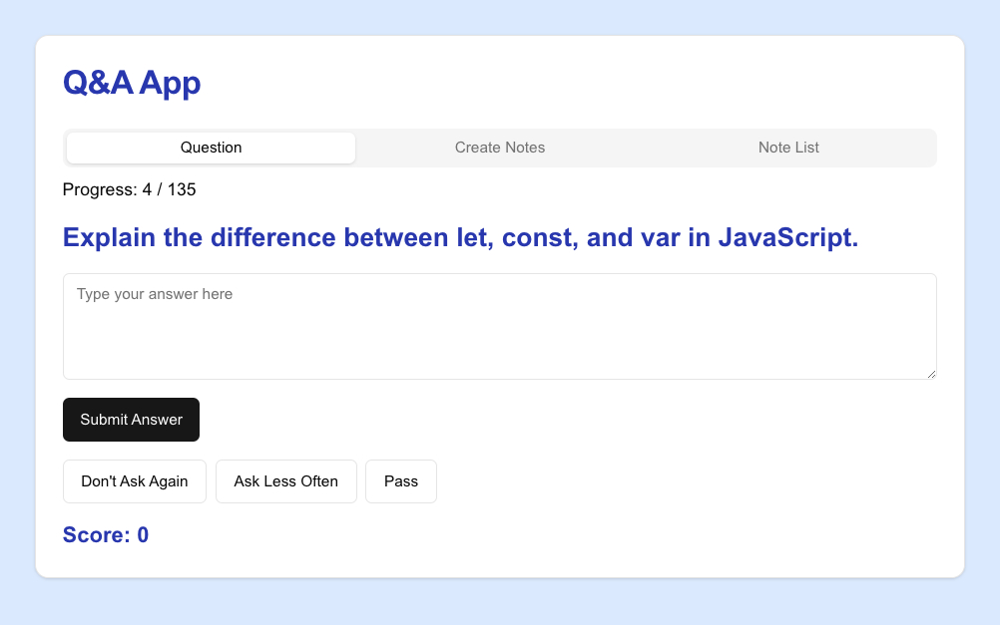

# Interactive JavaScript Quiz App

A dynamic quiz application for JavaScript learners, featuring:

- Multiple question types: multiple choice, open-ended, and coding challenges
- AI-powered answer evaluation using OpenAI and Anthropic APIs
- Personalized feedback and scoring system
- Question management: skip, retake, or block questions
- Note-taking feature for saved questions
- Progress tracking and performance analytics

Built with React and leveraging AI for an adaptive learning experience. Perfect for developers looking to sharpen their JavaScript skills with instant, intelligent feedback.

# AI-Powered Adaptive Quiz App for Developers

An intelligent quiz application designed to enhance coding skills across multiple languages and platforms.

## Current Features
- Question types: multiple choice, open-ended, and coding challenges
- AI-powered answer evaluation (OpenAI and Anthropic APIs)
- Personalized feedback and scoring
- Question management: skip, retake, or block questions
- Note-taking for individual questions
- Progress tracking

## Tech Stack
- React
- AI integration (OpenAI, Anthropic)
- JSON-based question bank (currently)

## Roadmap

### Short-term Goals
1. Implement automatic question generation component
2. Add functionality to save entire quizzes
3. Extend note-taking feature to cover full quizzes
4. Develop a template system for quiz creation
5. Connected to Redis for easy state storage and retrieval (might use postgress in the furure but don't think is necesary)
6. Create a login system and multilevel permisions
7. Create teams and invite team members
8. hability to export quizes
9. create CI/CD pipeline for easy feature creation and community involvement
10. Add geolocation and user identity verification (private for team members only)
11. Add internationalization
12. Add progress tracking wich charts for easy visualization of goals
13. dark mode

### Mid-term Goals
1. Enable quiz generation from existing quizzes
2. Create templates for popular coding platforms (HackerRank, IKM, LeetCode)
3. Expand language support beyond JavaScript and React
4. hability to take screenshots of question after being sumbited
5. hability to change the number of questions per quiz, currently is 10
6. Pomodoro style caunter and alarm sound when end of quiz is approaching
7. generate pdf of quiz taken and certificastions
8. gamify quizes to make it fun with challenges to other team members
9. create payment system, escrow and membership for teams and individuals
10. hability to create award such as badges, real money pits, place bets and bounties on quizes if you are a team member
11. video generation of the quizes being taken
12. customize level of difficulty, change percentage for each type of question
13. add peer programming mode and whiteboard and trello style kanba for team colaboration 

### Long-term Vision
- Comprehensive learning platform supporting all major programming languages
- Integration with real-world coding challenges and interviews
- Community-driven content creation and sharing of quizes and individual questions
- create api and integration with other platforms such as Notion, Discord
- Create automation

## Current Limitations
- Limited to JavaScript and React questions
- Relies on pre-defined JSON question bank
- Only saves notes to local state

Join us in revolutionizing how developers practice and enhance their coding skills!
